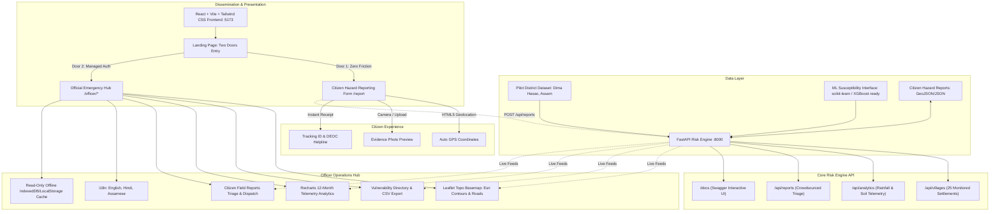

# System Architecture: NER Landslide Early Warning System (LEWS)

## 1. Architectural Philosophy: Risk Engine + Dissemination Layer

The NER-LEWS architecture is inspired by modern early warning architectures such as **Google Flood Hub** and **USGS ShakeAlert**:
1. **Core Risk-Engine (Backend)**: An analytical service that continuously computes kinematic slope susceptibility and antecedent precipitation indices (API) from historical and static telemetry.
2. **Dissemination & Response Layer (Frontend)**: A role-specialized interface that bifurcates citizen crowdsourcing from official emergency response, ensuring immediate civil defense mobilization without operational friction.



---

## 2. Decided Architecture Choices

### A. Two Entry Doors (No Shared Login)
- **Problem**: Shared login flows force citizens into account creation, resulting in >80% drop-off during roadside emergencies. Conversely, officers require verified identity and district scoping.
- **Solution**:
  - `/report`: 1-tap hazard submission requiring zero authentication. Captures hazard type, GPS coordinate, photo, and optional phone.
  - `/officer/login`: Managed Firebase Auth scoping the session to Dima Hasao, Assam. Single-click demo accounts provided for rapid evaluator demonstration.

### B. Map Visualization Strategy
- **Basemap**: Esri World Topo Map / OpenTopoMap tiles render natural terrain contours, elevation lines, river valleys (Kopili, Mahur), and national highway infrastructure (NH-27) for free without custom GIS server overhead.
- **Kinematic Markers**:
  - `0–25`: Low (Emerald Green)
  - `26–50`: Moderate (Amber Yellow)
  - `51–75`: High (Deep Orange)
  - `76–100`: Critical / Severe (Crimson Red with animated pulsing radar wave)
- **Hover Micro-Interactions**: Smooth tooltip showing coordinates, slope gradient, 72-hour antecedent rainfall, soil saturation, and suggested civil defense actions.

### C. Offline Read-Only Resilient Cache
- In hill areas with intermittent connectivity, the dashboard caches all telemetry in client-side storage (`localStorage` / IndexedDB).
- When `navigator.onLine === false`, the application displays an informational top banner:
  > *"Offline Mode: Showing cached surveillance data from [timestamp]. Read-only cache active; field operations queued."*
- A dedicated **[Demo: Test Offline Cache Banner]** toggle allows evaluators to inspect this feature during the presentation.

### D. Localization Framework (22 Scheduled Languages)
- Fully scaffolded with `react-i18next`.
- Fully translated in 3 core languages:
  1. **English (`en`)**
  2. **Hindi (`hi`)**
  3. **Assamese (`as`)** — Official language of the pilot district state.
- Dropdown indicates additional regional languages (Bengali, Bodo, Manipuri, Khasi, Garo, Mizo, Nagamese, Nepali) scheduled for production roll-out.

---

## 3. Data Schema Specifications

### Settlement Telemetry Record
```json
{
  "id": "VIL-001",
  "name": "Jatinga Ridge",
  "subdivision": "Haflong",
  "district": "Dima Hasao",
  "state": "Assam",
  "lat": 25.1311,
  "lon": 93.0411,
  "elevation_m": 1020,
  "slope_deg": 44.2,
  "rainfall_72h_mm": 248.5,
  "soil_moisture_pct": 89.2,
  "risk_score": 88,
  "risk_band": "Critical",
  "contributing_factors": [
    "Severe pore-water pressure along Disang shale-sandstone boundary",
    "Sustained 72h precipitation exceeding 240mm threshold",
    "Structural weathering on steep 44° road cut slope"
  ],
  "suggested_action": "Evacuate downhill habitations; close Jatinga bypass to heavy vehicles; stage SDRF quick response unit."
}
```

### Citizen Hazard Report Record
```json
{
  "id": "REP-2026-ED2405",
  "hazard_type": "crack | slope_movement | blocked_road | rockfall",
  "description": "Tension crack observed expanding along highway cutting",
  "lat": 25.1311,
  "lon": 93.0411,
  "location_name": "Jatinga Curve km 72",
  "phone_number": "+91 94350 12345",
  "photo_url": "https://...",
  "status": "pending | reviewed | actioned",
  "created_at": "2026-09-09T06:30:54Z",
  "officer_notes": "SDRF unit dispatched for inspection."
}
```

---

## 4. Future Integration Roadmap (For Pitch Presentation)

| Component | Current Prototype | Future Production Architecture |
|---|---|---|
| **Rainfall Telemetry** | Historical & heuristic 72h rainfall model | IMD Automated Weather Stations (AWS) + GPM IMERG satellite rainfall API |
| **Terrain / DEM** | 25 surveyed hill points & Esri Topo | ISRO Bhuvan 10m CartoDEM + ALOS PALSAR high-res SAR |
| **Susceptibility Model** | Geotechnical kinematic heuristics (Slope + Rain + Soil Moisture) | Trained XGBoost / LightGBM ensemble on GSI Bhukosh landslide inventories |
| **Dissemination** | Web Dashboard + Citizen Portal | NDMA SACHET Common Alerting Protocol (CAP) via SMS cell-broadcasts |
